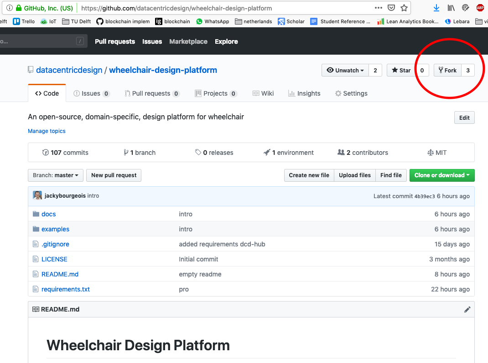
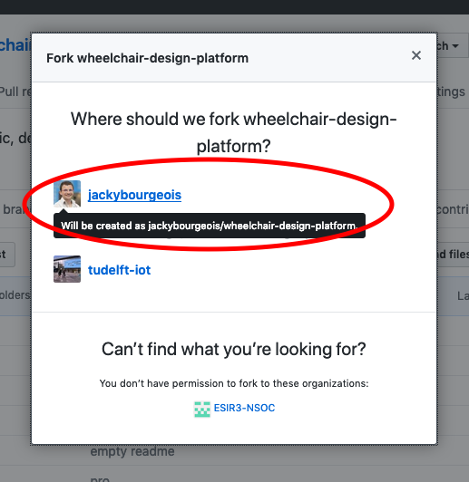
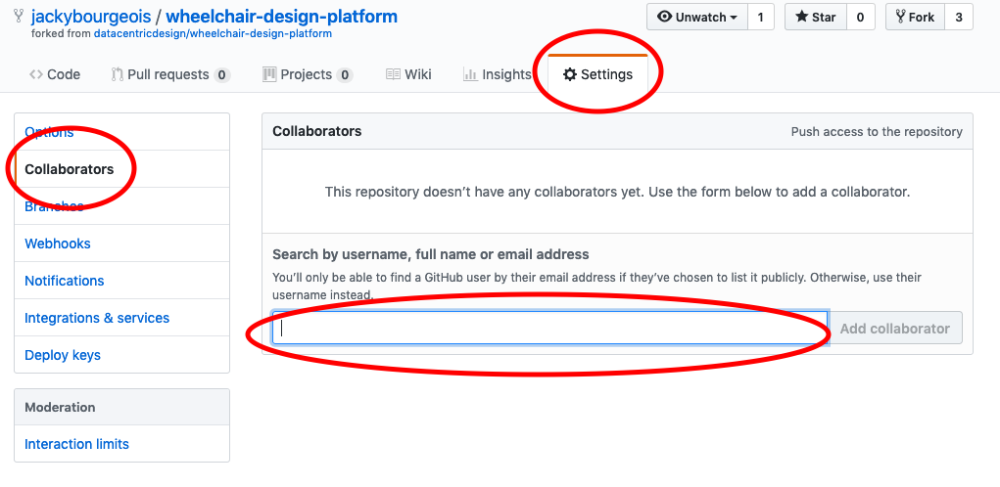
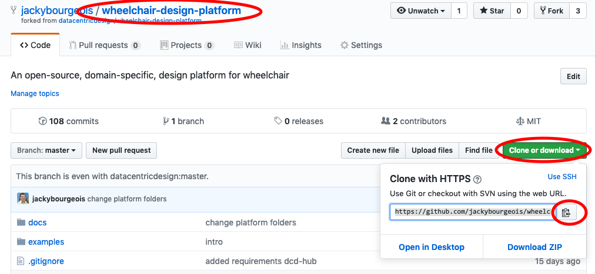
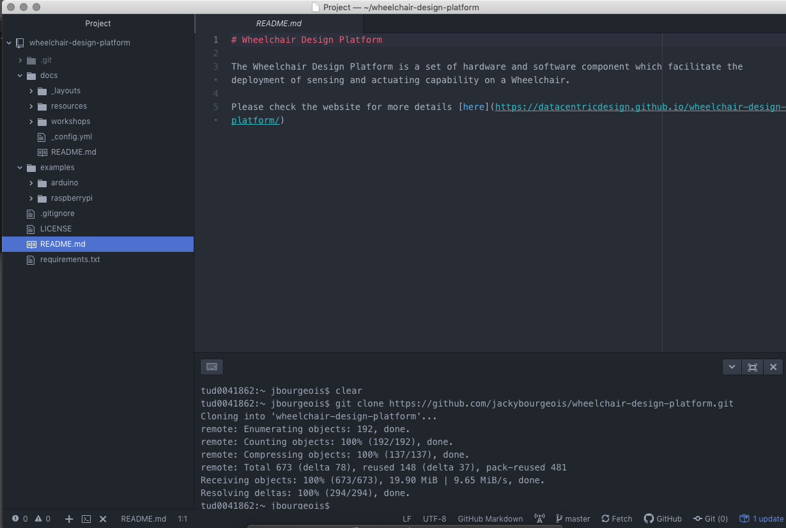
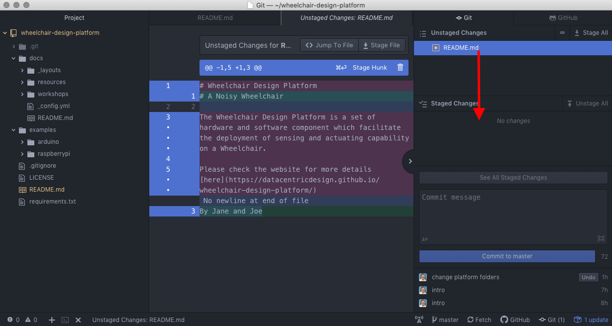
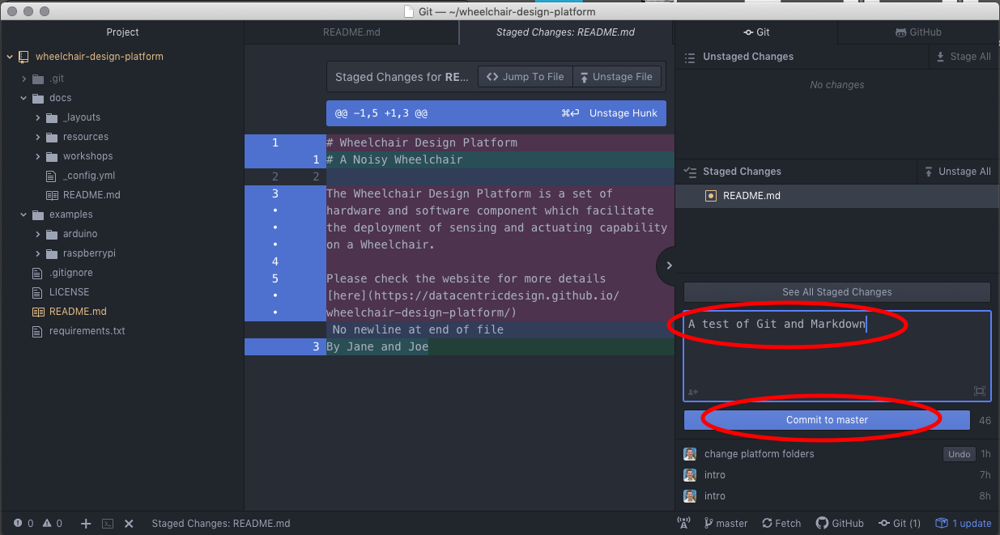

# Workshop 1: Building an Internet-connected Wheelchair

1. [Git Flow](#1-git-flow)
2. [Data-Centric Data Hub](#2-data-centric-design-hub-per-group)
3. [Run Python Example](#3-run-python-example)
4. [Data Collection with Arduino](#4-data-collection-with-arduino)
5. [Setting up the Raspberry Pi](#5-setting-up-the-raspberry-pi)


# 1 Git Flow

### 1.1 Fork Wheelchair Design Platform repository (only one member of the group)

*'A fork is a copy of a repository. Forking a repository allows you to freely
experiment with changes without affecting the original project.'*
<a href="https://help.github.com/articles/fork-a-repo/" target="_blank">(GitHub Help)</a>

Go to the GitHub repository of the Wheelchair Design Platform:
<a href="https://github.com/datacentricdesign/wheelchair-design-platform" target="_blank">https://github.com/datacentricdesign/wheelchair-design-platform</a>

On the top-right corner of this GitHub page, click on Fork.



In the dialog, select your account (where you create the copy of the repository).



You now have a copy of the wheelchair-design-platform repository on your own account.

### 1.2 Add members to repo (only one member of the group)

Your repository is publicly accessible for reading. However, you need to give
the other members of the group access to this repository. On the top menu, click
*'Settings' > 'Collaborators'*. Search the username of your group members and add them.



### 1.3 Create a project (only one member of the group)

GitHub offers a convenient way of managing your projects with a Kanban (scheduling system) style
board. On the top menu, click on 'Projects' and click on the green button 'New
Project'. Fill in a project name, select the template 'Basic Kanban' and click
'Create project'. You can use this space to map your tasks and your progress.


### 1.4 Clone repository (all group members)

*'When you create a repository on GitHub, it exists as a remote repository. You
can clone your repository to create a local copy on your computer and sync
between the two locations.'*
<a href="https://help.github.com/articles/cloning-a-repository/" target="_blank">(GitHub Help)</a>

On GitHub, at the top of you repository, click on the green button 'Clone or
download' and copy the provided link.



Go back to the Atom terminal, and type 'git clone' followed by the link you copied.
For example:

```bash
git clone https://github.com/example/wheelchair-design-platform.git
```


Let's tell Git who we are, by typing the following commands (enter these commands one after the other):

```bash
git config --global user.email "YOUR EMAIL ADDRESS"
git config --global user.name "YOUR NAME"
```


## 1.5 Project in Atom

To open the project you cloned, click on 'File' > 'Open Folder' on the top menu and
select the folder you cloned. On the left panel, you can see the files of your
project.




Let's have a closer look:

* The .git folder contains the full history of your project, managed by git. Do not
edit or delete files in this folder;
* The docs folder contains documentation and workshops;
* examples contains all code examples to get started;
* .gitignore contains the list of files/file extensions you do not want to track
with Git. It is especially convenient for local configuration or passwords not
to be shared;
* LICENSE contains the MIT license for this project;
* README.md contains a short introduction to the platform in Markdown. Markdown
is a lightweight markup language, i.e. minimal set tags to format text;
* requirements.txt contains the list of the python libraries you need to install for
the project to work;

## 1.6 Git Flow

To experience the flow of Git, of updating and sharing progress, let's update the
 project documentation.

### Step 1: Edit (a) File(s)

When developing, it is common to document the project using Markdown. In Markdown,
we use '#' for titles and '*' for bullet points. More formatting can be found
[here](https://guides.github.com/features/mastering-markdown/)

Open README.md and add a title at the top of the file, for example:

```markdown
# A Noisy Wheelchair

By Jane and Joe
```


Note: A blue dot appears next to your file name README.md at the top of the page,
letting you know the changes to it are not saved. Press Command+S (or Ctrl+S) to save.

### Step 2: Stage, i.e Select File Changes

Your file appears in yellow in the left panel. It means that there are changes
in this file that are not yet tracked by Git (unstaged). Click on Git in the
bottom-right corner.

In the 'Unstaged changes', double-click on the README.md to 'stage' it, i.e.
prepare this file to track its changes. The middle tab shows you the
changes.



### Step 3: Commit, i.e Record Changes Locally

Then we add a 'Commit message' to briefly explain the nature of those changes,
e.g. 'A test of Git and Markdown'. Click on 'Commit to Master' to track the changes.
You have made one change (commit) to your local repository.



### Step 4: Push, i.e  Send Local Changes to GitHub

The final step consists in sharing this change with your peers. In the bottom-right
corner, click on 'push'. This will push your changes to the remote repository (on GitHub).

### Step 5: Fetch (or Pull), i.e Get the Latest Changes from GitHub

Other members of the group can now press 'Fetch' in the bottom-right corner to
update their local repository with the latest remote version.

## 2 Data-Centric Design Hub (Per group)

In the cloud we will use our prototyped cloud platform for designers that we call
Data-Centric Design Hub. In this cloud we use the following terms:

* People have a collection of Things.
* Things are physical or virtual entities with Properties.
* Properties are one-to-many dimensional data points.

In our wheelchair case, we have one Thing (the wheelchair) with properties such
as acceleration (3 values for x, y and z) or seat pressure (a value for each force
sensors on the seat).

Go to the hub manager via <a href="https://dwd.tudelft.nl/manager" target="_blank">dwd.tudelft.nl/manager</a>
and sign up as a group with an email address, a name and a password. The sign up
process creates an account, then the standard OAuth2 process starts with a consent: you
need to let the manager access your Things, so that it can help you manage them. To do so tick all the boxes
and click "allow access".

Once the consent succeeds, you can click on 'My Things' and create a first one.
For example with the name 'My wheelchair', type 'Wheelchair', and a
description 'An Internet-connected wheelchair'.

The process may take a few seconds, as the hub generates an access token for your Thing.

**COPY AND SAVE THIS TOKEN** in a text file, it will be shown only once and enables
your wheelchair to communicate with the hub. You can also save the thing id, but
you can always go back to the manager to retrieve this id.

Back to Atom and your project, let's create a first Python example.

## 3 Run Python Example

### 3.1 Dependencies

We use Pip to install the dependencies we need, listed in the file requirements.txt.
This file contains a dependence to the library writen for the Data-Centric Design
Hub as well as the a dependence for MQTT, a communication protocol we use to
talk to the hub.

Open the Atom terminal ('plus' sign in the bottom-left corner) and execute the following command.

```bash
pip3 install -r requirements.txt --user
```

Here we 'install' the Python dependencies for our project. The option -r indicates we provide a file name that contains
the required dependencies, the option --user indicates we install the dependencies
in a dependency folder specific for the current users.

## 3.2 Environment Variables

On the left panel, right-click on the root folder "wheelchair-design-platform" > New Folder and name it 'wheelchair'.

Copy the file examples > raspberrypi > get_started.py
in your 'wheelchair' folder.

Opening this file, this Python code import the necessary library, then we can see
the following lines:

```python
THING_ID = os.environ['THING_ID']
THING_TOKEN = os.environ['THING_TOKEN']
```

In Python, it means we look at the environment variables to read the id and
access token of our thing. To provide these information as environment variable,
right click at the root of your project (left panel) and create a file '.env'.

In this file, type in the following and paste your id and access token after
the equal signs.

```bash
THING_ID=
THING_TOKEN=
```

Note: We do not want to track the file '.env' with Git as it contains secrets. To
avoid any mistake, the file .gitignore list all files, folders and extensions to
ignore. You will fine '.env' in the list.

## 3.3 Read through the Python Code

Going back to the get_started.py Python script, read through the code and comments
to capture the main steps:

* Create and connect a Thing to the Hub
* Retrieve and display the Thing details
* If the Thing is not containing any property, create a dum property
* In any case, retrieve this dum property
* Continuously call a method that generate dum data and send them to the hub

Here are a few Python elements to note:

* Use # in Python to comment your code
* my_thing and my_property are variables
* To display information in the terminal, we use the method print()

```python
print("show text")
```

* Conditional statement: In Python we express the condition with 'if', elif
(else if) and else (more details
<a href="https://www.tutorialspoint.com/python/python_if_else.htm" target="_blank">here</a>.

In our case, we check if the thing details we retrieved from the server has no property
(a newly created Thing) and then create a dum property.

```python
if len(my_thing.properties) == 0:
    # create a dum property
```

* Indentation is key in Python. Take the previous example of condition, the indentation
define what is in the condition. Any following line align with the if would be
considered outside the condition.

## 3.4 Execute the Python code

Let's execute this code. Go to the Atom terminal and type in the following command:

On Mac

```bash
python3 wheelchair/get_started.py
```

On Windows

```bash
python wheelchair\get_started.py
```

If the example runs properly you should see a log generated every two seconds,
indicating dum data is being sent to the Hub.

## 3.5 Visualise Data on Grafana

To visualise this data, we use Grafana.

Go to the <a href="https://dwd.tudelft.nl/grafana" target="_blank">dwd.tudelft.nl/grafana</a>,
click on 'Sign in with OAuth'. Fill in your Data-Centric design Hub email and
password. Similarly to the manager, consent to let Grafana access your data.


Click on the plus on the left panel and create a new folder for your project.
Then, create a new Dashboard and select a new panel 'Graph'. At the top of this
new panel, click on 'Panel Title > Edit'

At the bottom, in the query element GROUP BY, click on time and 'remove'.

In FROM, click on 'Select Measurement' and select your Property ID. If your
Property ID is not appearing in the list, the hub is not receiving data from
your python code.

In SELECT, click on field and select Value1. Then click on the
plus > Fields > Field to add Value2 and Value3.


Back in the Atom terminal, stop your Python script with CMD+C (Ctrl+C).

# 4 Data Collection with Arduino

In this section we will log short and long press events of a push
button. It highlights that a sensor-based data point can be as simple as a button
event and tell us about how a user make use of it.

## 4.1 Push Button Example

In Atom, copy the folder examples > arduino > push_button_led_log
in your 'wheelchair' folder. Then, open this folder in Arduino IDE.

Looking at the code, we recognise the Arduino-like structure in three blocks:

* Declaration of variables and libraries, available throughout the code.
Note by convention, the constants are in uppercase (variables that will not change
during the programme) while other variables are in lowercase.

```cpp
int BUTTON_PIN = 22; // choose the input pin for the push button
int LED_PIN = 13;    // Choose the output pin for the LED

long LONG_PRESS_TIME = 500; // How long is a 'long press' (minimum, in ms)

long buttonActiveSince = 0; // Since when the button has been pressed (in ms since Arduino started)
boolean longPressActive = false; // Are we currently in a 'long press' event
```

* The setup() method executed once when the Arduino starts;

```cpp
void setup() {
  pinMode(BUTTON_PIN, INPUT);    // declare pushbutton as input
  pinMode(LED_PIN, OUTPUT);      // declare LED as input

  Serial.begin(9600); // setting baud speed for Serial (a baud is a pulse)

  // 'print' on the Serial port, i.e send a message through the serial port
  Serial.println("Lets start using the button!");
}
```

* The Loop() method executed infinitely after the setup method.

```cpp
void loop() {
  // Is button active?
  if (digitalRead(button) == LOW) {
    // if the button was not yet pressed
    if (buttonActiveSince == 0) {
        buttonActiveSince = millis();
    } else if ((millis() - buttonActiveSince > LONG_PRESS_TIME)
                && longPressActive == false) {
          longPressActive = true;
          digitalWrite(led, HIGH);  // turn LED ON
        }
    }

  // Was button active?
  } else {
    // Was Long Press event?
    if (buttonActiveSince > 0) {
      // End Long Press event
      if (longPressActive == true) {
        Serial.println("button-action,2");
        digitalWrite(led, LOW);  // turn LED OFF
        longPressActive = false;

      // End Short Press event
      } else {
        Serial.println("button-action,1");
      }
      buttonActiveSince = 0;
    }
  }

}
```

The following flow chart illustrates the algorithm of this example code.


In Arduino IDE, in the top menu 'Tools > Boards' select 'Arduino/Genuino Mega or Mega 2560'

Then press the Verify button (green circle with tick).

## 4.2 Wire Push Button and LED

In this example we need three wires, a resistor, an LED and a push button.


## 4.3 Connect Arduino

Use the USB cable to connect the Arduino to your laptop.

In Arduino IDE, in the top menu Tools > Port select your Arduino

Then press the Flash button to send the code into the Arduino (green circle with right arrow)

In the Arduino IDE, in the top menu 'Tools' open the 'Serial Monitor'.
Look at the input, pressing the push button should turn on the LED and produce a
log in the Serial Monitor.


## 4.4 Update Python Example

The last step is to adapt the Python code on your laptop to read the Serial input
from the Arduino and forward them to the Data-Centric Design Hub.

You can copy the code from examples/serial_example.py in your wheelchair folder.

In this code, we use the environment variable again to provide the thing id and token.

We need an extra environment variable to specify the serial port. You can find
it on the Arduino IDE, in the top menu Tools > Ports. For example:

```bash
THING_ID=
THING_TOKEN=
SERIAL=/dev/cu.usbmodem14201
```

We are now ready to run the Python code

On Mac

```bash
python3 wheelchair/serial_example.py
```

On Windows

```bash
python wheelchair\serial_example.py
```

Go back to Grafana to visualise the inputs


# 5 Setting up the Raspberry Pi

The next step consists in setting up the RaspberryPi and running your code on it.

Insert the SD card in your laptop.

### Set up an empty SD Card

__**(Skip thi section if you have an SD Card with NOOBS pre-installed)**__

Download and install the software

Get the lattest Raspbian here: https://www.raspberrypi.org/downloads/raspbian/

Unzip the file, you obtain an image file (extension .img)

To install this image on the SD card, download and install Etcher: https://www.balena.io/etcher/

Starting Etcher, you first select your image file, then your SD card, and 'Flash'.

To connect to the Raspberry Pi without monitor, mouse and keyboard, we use directly
your laptop. To do this, we need to enable the ssh protocol on the Raspberry Pi
(secure remote access to a computer).

On your laptop, open text editor (TextEdit on Mac, Editor on Windows) and save an
empty file named 'ssh' (without extension). This file will indicate that we want
to enable ssh.

(add process for network auto config)

Eject the SD card and insert it in on the Raspberry Pi, then power the Pi

(Scan and find your IP address)

Open a terminal (or 'command prompt' on Windows). Type in

```
ssh pi@<your ip address>
```

Update

```
sudo apt-get update
sudo apt-get upgrade
```

Create a folder

```
mkdir wheelchair
cd wheelchair
```

Set up Git

```
sudo apt-get git
```

Clone your GitHub repository

git clone


* Main Components

* Architecture

* Setting up the Raspberry Pi

* Network

* Bash commands
